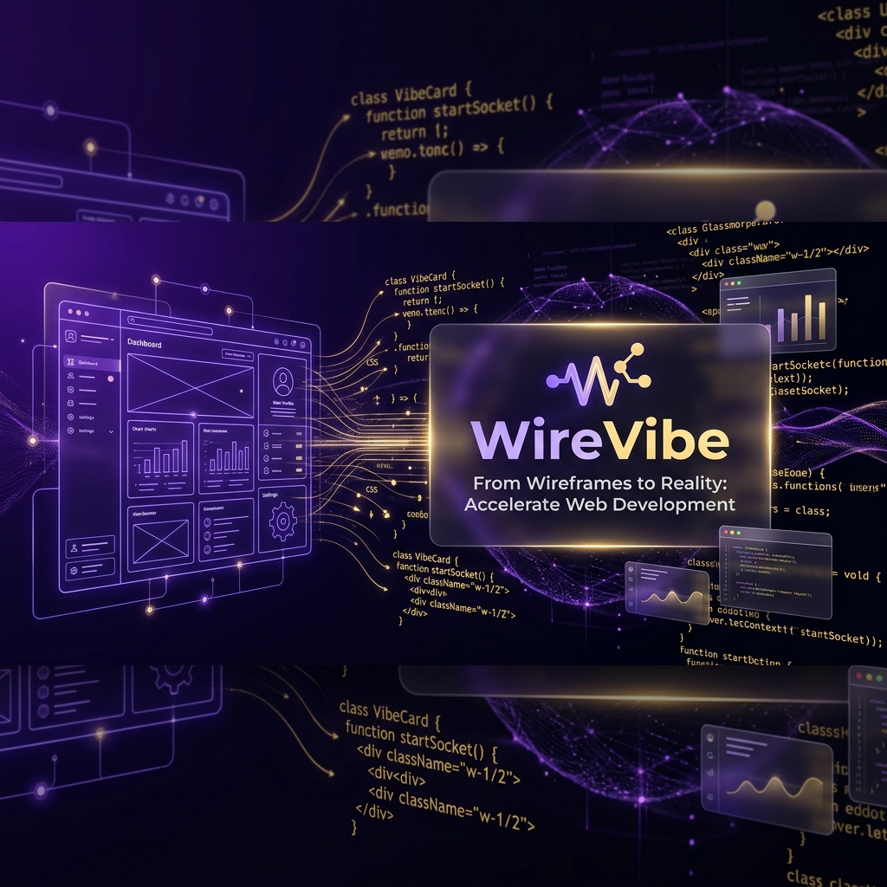

<div align="center">
  
  
# ✨ WireVibe

**Sketch your ideas. Vibe it to reality.** <br>
*An AI-powered canvas that magically transforms your rough wireframes into production-ready HTML/CSS code.*

[](https://opensource.org/licenses/MIT)
[](https://developer.mozilla.org/en-US/docs/Web/HTML)
[](https://developer.mozilla.org/en-US/docs/Web/CSS)
[](https://developer.mozilla.org/en-US/docs/Web/JavaScript)
[](https://ai.google.dev/)
[](https://rafiaminhaj.github.io/WireVibe-/)
[](https://github.com/Rafiaminhaj/WireVibe-/pulls)
[](https://github.com/Rafiaminhaj/WireVibe-)

[🌐 Live Demo](https://rafiaminhaj.github.io/WireVibe-/) · [🐛 Report Bug](https://github.com/Rafiaminhaj/WireVibe-/issues/new?template=bug_report.md) · [✨ Request Feature](https://github.com/Rafiaminhaj/WireVibe-/issues/new?template=feature_request.md)

</div>

---

## 🌟 The Concept
Ever had a great idea for a UI but didn't want to spend hours writing the boilerplate code? **WireVibe** is here to bridge the gap between imagination and execution. 

Built for the **Elite Coders Open Source Hackathon 2026**, WireVibe allows developers and designers to sketch a rough wireframe directly on a web canvas. With a single click of the **"Vibe It"** button, the app performs a stunning 3D flip animation and generates the corresponding HTML and CSS code instantly.

## 🚀 Features

| Feature | Description |
|---------|-------------|
| 🎨 **Interactive Canvas** | Smooth freehand drawing with customizable brush sizes and colors |
| ✏️ **Smart Eraser** | 8x fat eraser with `destination-out` compositing for quick editing |
| 📷 **Image Upload** | Upload existing wireframe sketches directly onto the canvas |
| 🤖 **AI Code Generation** | Google Gemini 1.5 Flash Vision API converts sketches to HTML/CSS |
| 🔐 **BYOK Security** | Bring Your Own API Key — stored only in `localStorage`, never on servers |
| 🎭 **3D Flip Animation** | Cinematic `preserve-3d` card flip with scanning laser effect |
| 📱 **Device Preview** | Toggle Desktop (100%), Tablet (768px), Mobile (375px) viewports |
| 💾 **One-Click Export** | Download generated code as `.html` with confetti celebration 🎉 |
| 🤖 **VibeBot Assistant** | Floating AI guide that walks you through the process |
| 🎨 **Glassmorphism UI** | Modern frosted-glass design with smooth animations |
| ⚡ **Zero Dependencies** | Pure HTML, CSS, and Vanilla JS — no build tools needed |

## 🏗️ Architecture

```
WireVibe/
├── index.html              # Main HTML structure
├── style.css               # Design system (glassmorphism, animations)
├── script.js               # Core logic (6 modular sections)
│   ├── Module 1: Canvas Engine
│   ├── Module 2: Tool Manager
│   ├── Module 3: File I/O
│   ├── Module 4: AI Engine (Gemini API)
│   ├── Module 5: Preview System
│   └── Module 6: Settings Manager
├── vercel.json             # Deployment config with security headers
├── assets/                 # Banner and static assets
│   └── banner.png
├── .github/
│   ├── ISSUE_TEMPLATE/
│   │   ├── bug_report.md
│   │   └── feature_request.md
│   └── PULL_REQUEST_TEMPLATE.md
├── CONTRIBUTING.md         # How to contribute
├── CODE_OF_CONDUCT.md      # Community guidelines
├── SECURITY.md             # Security policy
├── CHANGELOG.md            # Version history
├── DEPLOYMENT.md           # Deployment guide
├── LICENSE                 # MIT License
└── README.md               # You are here!
```

## 🛠️ Tech Stack

| Technology | Purpose |
|-----------|---------|
| HTML5 | Semantic page structure |
| CSS3 | Glassmorphism, 3D transforms, animations |
| Vanilla JavaScript (ES6+) | All application logic |
| Canvas API | Freehand drawing engine |
| Google Gemini 1.5 Flash | AI vision-based code generation |
| Highlight.js | Syntax highlighting for generated code |
| canvas-confetti | Download celebration effects |

## 💻 How to Run Locally

Since WireVibe has **zero build steps** and **zero dependencies**, running it is incredibly simple:

```bash
# 1. Clone the repository
git clone https://github.com/Rafiaminhaj/WireVibe-.git

# 2. Open the project folder
cd WireVibe-

# 3. Open in browser — that's it!
# Double-click index.html or use a live server
```

> 💡 **Optional:** For AI features, get a free API key from [Google AI Studio](https://aistudio.google.com) and enter it in Settings.

## 🔐 Security

WireVibe follows a **zero-trust, client-side-only** security model:
- ✅ No backend server — runs entirely in the browser
- ✅ No data collection or tracking
- ✅ API keys stored only in `localStorage`
- ✅ Security headers configured in `vercel.json`

See [SECURITY.md](./SECURITY.md) for our full security policy.

## 🤝 Contributing

We welcome contributions! Whether it's adding new features, fixing bugs, or improving documentation.

1. Fork the Project
2. Create your Feature Branch (`git checkout -b feature/AmazingFeature`)
3. Commit your Changes (`git commit -m 'feat: add some AmazingFeature'`)
4. Push to the Branch (`git push origin feature/AmazingFeature`)
5. Open a Pull Request

See [CONTRIBUTING.md](./CONTRIBUTING.md) for detailed guidelines.

## 📜 License

Distributed under the MIT License. See [LICENSE](./LICENSE) for more information.

## 🙏 Acknowledgments

- [Google Gemini AI](https://ai.google.dev/) — Vision API powering code generation
- [Highlight.js](https://highlightjs.org/) — Beautiful syntax highlighting
- [canvas-confetti](https://github.com/catdad/canvas-confetti) — Celebration animations
- [Elite Coders](https://oshack.xyz) — For organizing this amazing hackathon

---
<div align="center">
  <b>Built with ❤️ by <a href="https://github.com/Rafiaminhaj">Rafia Minhaj</a></b><br>
  <i>Elite Coders Open Source Hackathon 2026</i><br><br>
  
  ⭐ Star this repo if you found it useful!
</div>
